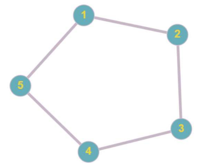
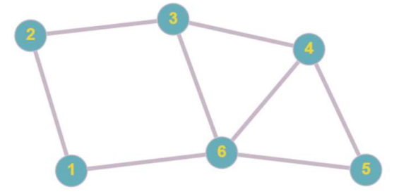
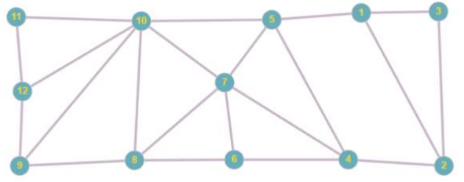

# Projeto Bar dos Filósofos
    Autor: Matheus Freitas
    Email: fernandes.matheus@aluno.uece.br
    Disciplina: Programação Paralela e Concorrente

## Como rodar o projeto:

Para executar este projeto você precisará do dotnet 8 ou maior. Essa é o único requisito para rodar o projeto.

Basta que clonar o repositório:

```bash
git clone https://github.com/Fer-Matheus/Bar-dos-Filosofos.git 
```

### **Executando o projeto**

Tendo instalado o dotnet, você pode executar o seguinte comando no terminar:
```bash
dotnet run <qual grafo você deseja usar como entrada do bar dos filósofos>
```
O programa espera três possiveis entradas:

`G1` -> Informa que o primeiro grafo deve ser usado. Ele possue a seguinte configuração:
```bash
dotnet run G1
```


`G2` -> Informa que o primeiro grafo deve ser usado. Ele possue a seguinte configuração:
```bash
dotnet run G2
```


`G3` -> Informa que o primeiro grafo deve ser usado. Ele possue a seguinte configuração:
```bash
dotnet run G3
```

